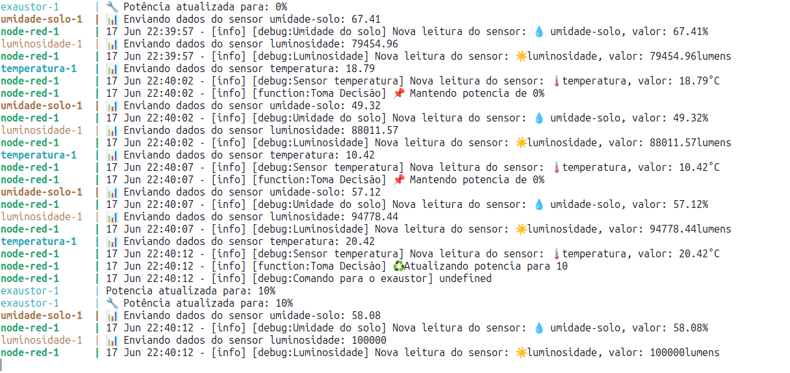

# Atividade

Implementação e Avaliação de Comunicação IoT com Múltiplos Protocolos

# Turma

SAJ-OPC16 - Tópicos Avançados em Web I 
2025.1

# Equipe

Antônio Salgueiro
Adriano Victor
Filipe Ribeiro

# Cenario: Estufa automatizada

O cenario desenvolvido, comforme sugerido foi o de uma estufa automatizada.

# Estrutura


# Sensores

Os sensores simulados foram os de luminosidade, temperatura e umidade do solo.

# Atuadores

Tambem foi simulado um atuador, um exaustor que tem como objetivo diminuir a temperatura da estufa 

# Logica de decisão

A logica de decisão foi implementada dentro do Node Red usando um Function Node:

(Observe que o node red só envia o comando de alteração de potencia quando a potencia desejada muda)

```
var new_potencia = 0;

var sensor_read = msg.payload.valor

if(sensor_read > 35){
    new_potencia = 90
} else if (sensor_read > 25) {
    new_potencia = 50
} else if (sensor_read > 20) {
    new_potencia = 10
} else {
    new_potencia = 0
}

var old_potencia = context.get("old_potencia")

if( old_potencia == new_potencia) {
    node.log(`📌 Mantendo potencia de ${old_potencia}%`);
    return;
}

node.log(`♻️ Atualizando potencia para ${new_potencia}`);
context.set("old_potencia", new_potencia)
return {payload:{potencia: new_potencia}};
```

# Protocolos utilizados

## Mqtt Mosquitto

Foi implementado na comunicação entre os sensores e o Node Red

### Segurança

Foi implementada TLS tanto para criptografia quanto para autenticação, sendo necessario que os clients do broker apresentem certificados validos.

## Amqp RabbitMQ

Foi implementado na comunicação entre o Node Red e o atuador

### Segurança

Foi utilizada a autenticação através de usuario e senha

## Comparação

| Característica            | MQTT (Mosquitto)                                 | AMQP (RabbitMQ)                                      |
| ------------------------- | ------------------------------------------------ | ---------------------------------------------------- |
| **Modelo de Mensagem**    | Publish/Subscribe (Pub/Sub)                      | Message Queue (Fila) com roteamento avançado         |
| **Padrão**                | Leve, ideal para IoT                             | Mais robusto, corporativo                            |
| **Entrega de Mensagens**  | Best effort + QoS (0, 1, 2)                      | Garantida com confirmação (ACK) e filas persistentes |
| **Persistência**          | Opcional, geralmente volátil                     | Fila persistente por padrão                          |
| **Segurança**             | TLS com certificados (mutual TLS implementado)   | Login/senha (mais simples, direto)                   |
| **Overhead de Protocolo** | Muito baixo (ideal para dispositivos embarcados) | Mais pesado, maior consumo de rede e CPU             |
| **Roteamento**            | Simples: baseado em tópicos                      | Complexo: tópicos, direct, fanout, headers           |
| **Casos de Uso**          | Comunicação rápida entre sensores (telemetria)   | Orquestração de comandos para atuadores              |
| **Confiabilidade**        | Média, dependendo do QoS                         | Alta, mensagens garantidas até serem processadas     |

| Protocolo | Uso no Projeto                                 | Justificativa                                                                                                                                                             |
| --------- | ---------------------------------------------- | ------------------------------------------------------------------------------------------------------------------------------------------------------------------------- |
| **MQTT**  | Comunicação entre **sensores** e **Node-RED**  | Leve, eficiente, baixo overhead, ideal para dados periódicos de sensores. Além disso, suporta milhares de conexões simultâneas com mínimo uso de banda e CPU.             |
| **AMQP**  | Comunicação entre **Node-RED** e **atuadores** | Oferece garantia de entrega, filas robustas, roteamento avançado e controle mais rigoroso, essencial quando um comando (ex.: "Ativar exaustor") **não pode ser perdido**. |

# Monitoramento

A simulação foi desenvolvida para ser implantada usando docker compose, sendo possivel monitorala diretamente através dos logs do compose up

Tambem é possivel realizar o monitoramento através do dashboard de debug do Node Red



# Bugs e Problemas

### Problema com permissões

Programas em um container por padrão rodam como root

O normal no linux geralmente é o 1000

A imagem do broker Mosquitto roda internamente no usuario 1883

Isso causou alguns problemas durante o desenvolvimento que foram resolvidos dando permissão de leitura de pelo menos chmod 111

### Implantar no Node Red

Após adicionarmos a biblioteca de terceiros @stormpass/node-red-contrib-amqp para termos suporte a AMQP, o node red passou a crashar sempre que implantamos, apesar da mensagem no painel web que a implatação falhou, ela ocorre normamente o docker reinicia o node red

### RabbitMQ

O rabbit mq demora bastante para iniciar, e mesmo tentando configurar o healtcheck do docker para ele, outros serviços ainda inicializam e reportam erros de conexão com ele, más após ele terminar de inicializar tudo se ajusta.

# Conclusão

Levando em conta nossa experiencia com a materia de Sistemas Distribuidos ministrada pelo mesmo professor, onde desenvolvemos diversas aplicações utilizando tecnicas de comunicação de baixo nivel, a eficiencia dos protocolos de iot demonstrou ser imensamente mais simles e robusta, visto que o protocolo já nos fornece de maneira robusta funcionalidades como confirmação de entrega, redundancia, escalabilidade dentre outras de maneira buildin, nos permitindo nos preocupar somente com a logica de negocios real da aplicação.

Sobre o Node Red, foi a nossa primeira experiencia com um ferramenta low-code, e foi muito agradavel, principalmente o fato de nos permitir editar o comportamento e implantar a nova versão diretamente do navegador, sem termos que reiniciar todos os serviços.

